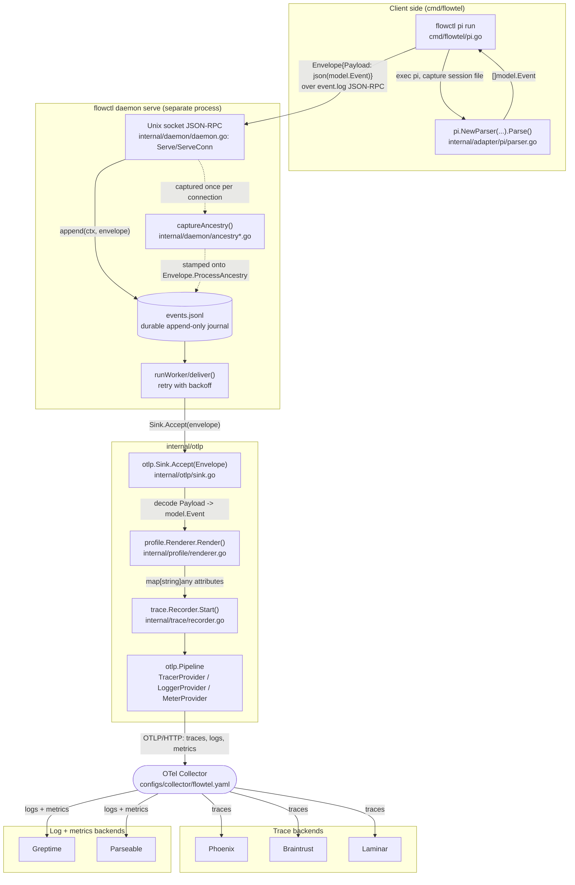
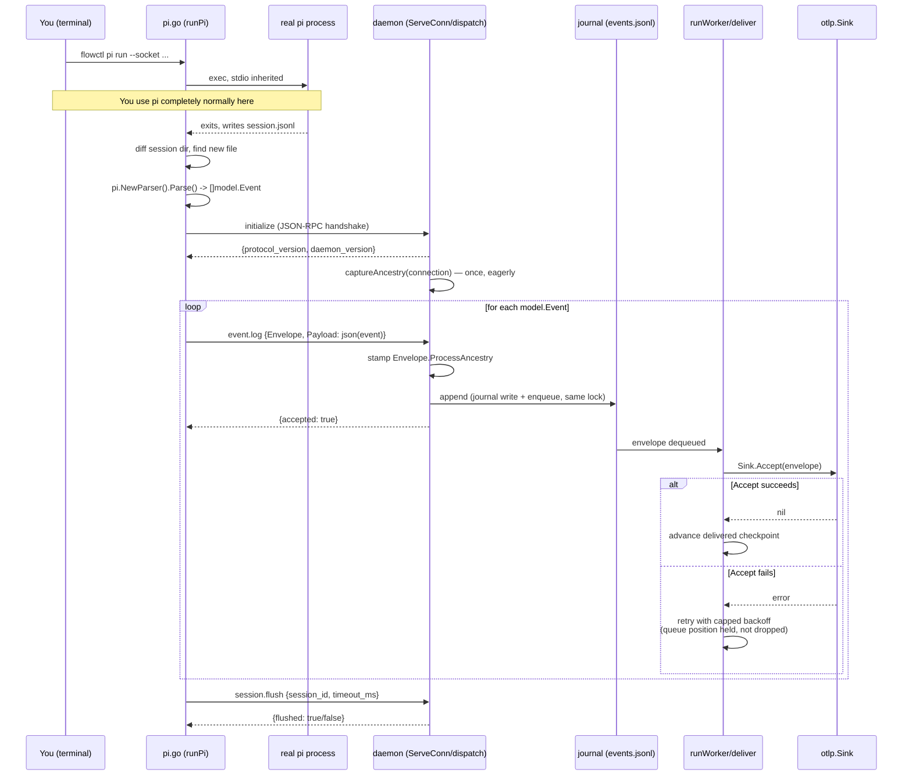

# Onboarding to Flowtel

You just cloned this repo, and — unlike most projects you onboard onto — you didn't write the first draft of it. Most of `flowtel` was built by an AI across a single long working session, with you steering decisions but not typing every line. That's actually a fine way to end up owning a codebase, but it means the thing you're missing that a human author would normally give you for free is the running narrative in their head of *why* things are shaped the way they are. This document is that narrative, written down. Read it once before your first change, and you should be able to explain the core design back to someone else without looking anything up.

## What This Project Actually Is

Flowtel watches an AI coding harness — right now, specifically the `pi` CLI — while it works, and turns what it did into OpenTelemetry data: traces that show the shape of the session (which LLM calls happened, which tools ran, what permissions were granted or denied, all correctly parented to each other), and bounded, redacted logs for the events that matter for an audit trail. That data goes out over the standard OTLP protocol to whatever observability backend you point it at — Phoenix, Braintrust, Laminar, Greptime, Parseable, or in principle anything else that speaks OTLP.

The thing that makes flowtel worth building instead of just using an existing library is the very specific shape of its restraint. `SPEC.md` states this as a set of explicit non-goals, and it's worth reading them as design decisions rather than as limitations: no Flowtel UI, because the whole point is that Phoenix or Braintrust's UI is where you look at this data, not a new dashboard flowtel has to build and maintain. No model-provider SDK dependency, because flowtel sits at the harness layer — after the provider call has already happened — so it never needs to know what "Anthropic" or "OpenAI" is. No `braintrust.*` or `phoenix.*` attributes, because the moment flowtel starts speaking a vendor's private attribute dialect, it stops being portable, and portability is the entire value proposition. And no raw prompts, completions, or tool payloads by default, because an audit trail that leaks the actual conversation content isn't a safe thing to turn on by default for a coding agent that might be touching real credentials or a real production database.

If you want a single sentence for what kind of software this is: it's a thin, durable pipe from "a coding agent did something" to "a trace or log record describing that, in a vendor-neutral shape, arrived somewhere you can query it" — and every design decision in the codebase either serves that pipe or deliberately refuses to become something bigger than that pipe.

You'll see this contrast drawn explicitly if you look at Braintrust's own daemon, `bt-daemon` (a Rust project, unrelated to this repo but instructive to compare against). It has modules for capturing full OS process ancestry chains, for stitching together events arriving from many different hook integrations into one coherent trace, and for mirroring entire conversation transcripts into Braintrust's own storage. Flowtel deliberately doesn't build most of that, because it doesn't have Braintrust's problem: it has exactly one input format today (`pi`'s session JSONL, which already carries consistent parent/session IDs), one delivery destination per deployment (the Collector), and no cross-tool correlation problem to solve. Where flowtel *does* borrow a piece of that design — capturing the connecting process's ancestry chain, in `internal/daemon/ancestry*.go` — it does so for a narrower reason (audit provenance: "which shell actually spawned this"), not for correlation, and it's careful to say so in its own comments.

## Where It's Used, and By Whom

Honestly: this is a young, single-developer project. There's no `ADOPTERS.md`, no case studies, and `SPEC.md` itself is labeled "Status: planning baseline v0.1." It isn't foundation-backed and there's no public community around it yet — the "team" is you, working with AI assistance, and the git history reflects a single fast-moving session rather than a long multi-contributor project. That's worth knowing going in: you won't find prior art or established conventions to defer to beyond what's already in this repo's own `SPEC.md` and the three ADRs in `docs/adr/`. Those three documents (covered under "What You Should Know Before You Start" below) are the closest thing this project has to institutional memory, and they're short enough to read in full.

## Tech Stack

The core is Go — specifically `go 1.26`, per `go.mod` — and that choice makes sense once you look at what the daemon actually does: it holds a Unix socket connection open per harness process, journals every event to disk before doing anything else, and retries failed deliveries with backoff, all while staying responsive to new connections. That's a concurrency-and-I/O-bound problem, which is exactly Go's home turf, and the daemon's implementation leans on it directly — one goroutine per accepted connection (`ServeConn` in `internal/daemon/daemon.go`), one dedicated worker goroutine draining a buffered channel for delivery (`runWorker`), coordinated with plain `sync.Mutex`es rather than anything fancier.

The dependency that everything else hangs off is the official OpenTelemetry Go SDK (`go.opentelemetry.io/otel/...`). ADR 0001 is explicit about why: using the real OTel SDK instead of a hand-rolled wire format is what keeps flowtel's output actually interoperable with the OTLP ecosystem, at the cost of depending on upstream's versioning cadence. You'll see this SDK show up in three separate places doing three separate jobs — `sdk/trace` for spans, `sdk/log` for the audit log records, and (added this session) `sdk/metric` for the two standard GenAI usage/duration histograms — and each one gets its own OTLP HTTP exporter (`otlptracehttp`, `otlploghttp`, `otlpmetrichttp`) pointed at the same base endpoint with a different path suffix (`/v1/traces`, `/v1/logs`, `/v1/metrics`).

There's a second, much smaller cluster of dependencies purely for the CLI's own UX: `github.com/charmbracelet/bubbletea` and `lipgloss` power the `flowctl status` live TUI, and `golang.org/x/sys/unix` is what lets the daemon read the real PID of whatever process just connected to its socket (`SO_PEERCRED` on Linux, `LOCAL_PEERPID` on macOS) for the ancestry-capture feature. Notice what's *not* here: there's no logging framework like `logrus` — the CLI's colored leveled output in `cmd/flowtel/log.go` is hand-rolled on top of the stdlib's `log/slog`, specifically because a real design conversation concluded that five print statements didn't justify a new dependency when `slog` plus the `lipgloss` that was already there could do the whole job. That's a good tell for how to weigh future dependency additions in this codebase: the bar is "does stdlib or something already vendored actually fall short," not "is there a nicer library for this."

Outside the Go core, there's a completely separate, much simpler Next.js static site under `app/` — a one-page marketing/landing page with the project logo and links, built with the standard Next.js/Tailwind toolchain you'll see in `package.json`. It has nothing to do with flowtel's runtime behavior; don't confuse it with "the Flowtel UI" that `SPEC.md` explicitly says doesn't exist — that clause is about a trace-viewing dashboard, and this is just a homepage.

## Libraries and Why They're Here

Grouped by what job they do, rather than by where they sit in `go.mod`:

**Talking OTLP** is entirely the official OpenTelemetry family: `go.opentelemetry.io/otel` (the core API types — spans, attributes, contexts), `go.opentelemetry.io/otel/sdk`, `sdk/log`, and `sdk/metric` (the concrete implementations that batch and export), and the three `exporters/otlp/...http` packages that actually speak the wire protocol over HTTP. All of it funnels through `internal/otlp/pipeline.go`, which is the one place in the codebase that constructs `TracerProvider`, `LoggerProvider`, and `MeterProvider` instances and owns their lifecycle.

**Talking to the OS** is `golang.org/x/sys/unix`, used exclusively inside `internal/daemon/ancestry_linux.go` and `ancestry_darwin.go` to read a connecting process's credentials off the raw socket file descriptor, and to walk `/proc` (Linux) or call `SysctlKinfoProc` (Darwin) to build the process ancestry chain. This is the one place flowtel does genuine OS-specific syscall work, and it's isolated behind Go build tags (`//go:build linux`, `//go:build darwin`, and a portable no-op fallback for anything else) so the rest of the codebase never has to think about platform differences.

**The CLI's own presentation layer** is `bubbletea` and `lipgloss` for the `flowctl status` TUI, plus stdlib `log/slog` (no third-party logging library) for everything else the CLI prints. If you're adding a new CLI command and reach for output formatting, `cmd/flowtel/log.go`'s `consoleHandler` is the pattern to follow — it's a ~40-line `slog.Handler` implementation, not a new dependency.

**Testing infrastructure** deserves a mention because it's more interesting than usual here: `go.opentelemetry.io/otel/sdk/trace/tracetest` (a subpackage of the SDK you're already depending on, so it's not a new module) gives `internal/trace`'s tests a way to capture finished spans and inspect their actual attributes and events, rather than trusting that `span.SetAttributes` was called correctly. The same trick — decoding the real OTLP protobuf wire format with `google.golang.org/protobuf/proto` and `go.opentelemetry.io/proto/otlp/collector/trace/v1` — is what proved a real bug this session (`internal/otlp/pipeline_test.go`'s `TestPipelineRecordsActualEventEndTimestamp`): a test that only checked "did a request hit `/v1/traces`" would have missed that every span's end timestamp was silently wrong.

## Core Architecture

There are two ideas you need before anything else in this codebase will click, and they're related to each other.

**The first is the split between `Envelope` and `model.Event`.** These are easy to conflate because they both describe "one thing that happened during a coding session," but they exist at different layers and get confused with each other exactly once before it clicks. `Envelope` (`internal/daemon/protocol.go`) is the *transport* format — the JSON shape that travels over the daemon's Unix socket. It has routing fields the daemon actually reads and acts on (`SessionID`, `Event` name, `TimestampMS`) plus one field, `Payload`, that the daemon treats as completely opaque bytes. `model.Event` (`pkg/model/event.go`) is the *normalized* representation — a typed Go struct with `Kind` (session/agent/turn/llm/tool/permission/compaction), `Model`, `Provider`, token counts, cost, an `Error` string, and so on. The daemon never constructs or inspects a `model.Event`; it just journals and delivers `Envelope`s. The *client* side — specifically `cmd/flowtel/pi.go`'s `forwardPiSession` — is where a `model.Event` gets `json.Marshal`ed into an `Envelope.Payload` before it's sent, and `internal/otlp/sink.go`'s `eventFromEnvelope` is where it gets `json.Unmarshal`ed back out on the way to becoming a span. If you're ever confused about which one a piece of code should be touching, ask: is this code inside the daemon's durability boundary (write a JSONL line, deliver it, retry it) — then it wants `Envelope` — or is it code that actually understands what a "tool call" or "LLM turn" *means* — then it wants `model.Event`.

**The second is that the daemon is a durable pipe with exactly one extension point, the `Sink` interface**, and that interface is where the vendor-neutral boundary from ADR 0003 physically lives in the code. `Sink` is one method: `Accept(context.Context, Envelope) error`. The daemon's job stops at "did `Accept` return an error." It doesn't know or care that the concrete implementation, `otlp.Sink` (`internal/otlp/sink.go`), is going to decode the payload, wrap it as OTLP spans and logs, and push it out over HTTP — as far as the daemon is concerned, it could just as easily be writing to a file, or (as `daemon.NopSink` demonstrates) doing nothing at all. This is what ADR 0003 means by "the daemon does not know Braintrust, Phoenix, Laminar, Greptime, or Parseable" — that knowledge lives entirely downstream of `Sink`, in `otlp.Pipeline` and ultimately in the OTel Collector's own config file.

Once those two ideas are in place, the rest of the module layout reads as a straight pipeline: `internal/adapter/pi` turns `pi`'s actual session JSONL into `model.Event`s; `internal/profile` turns a `model.Event` into a `map[string]any` of span/log attributes, choosing which OpenInference and/or GenAI keys to emit based on the configured `Profile`; `internal/trace` takes those attributes and actually starts and ends an OTel span, including recording a structured `exception` event when `Error` is set; `internal/audit` builds the smaller, bounded, always-redacted log record that goes out alongside the span; and `internal/otlp` is where all three OTel signal types (trace, log, metric) actually get flushed to the wire.

### Architecture Diagram



Note the batch path (`flowctl ingest`) isn't drawn here because it skips the whole daemon subgraph — it calls `pi.NewParser` and `otlp.New` directly from `internal/ingest/runner.go`, with no socket, no journal, and no retry. Both paths converge on the same `internal/otlp` code once you're past the daemon boundary.

## How Data Actually Flows Through the System

There are two genuinely distinct flows here, and conflating them is the easiest way to confuse yourself while reading this codebase, so they're worth narrating separately.

**The live path** starts when you run `flowctl pi run --socket /path/to/daemon.sock`. Look at `cmd/flowtel/pi.go`: it resolves the real `pi` binary (via `FLOWTEL_PI` env override or `exec.LookPath`), snapshots which session files already exist under `pi`'s session directory, then runs `pi` with your real terminal's stdin/stdout/stderr wired straight through — so as far as you can tell, you're just using `pi` normally. Only after `pi` exits does anything flowtel-specific happen: `newestNewFile` diffs the before/after snapshot to find the session file `pi` just wrote, `forwardPiSession` opens it and runs it through `pi.NewParser(cfg.Profile, true).Parse(...)`, and the resulting `[]model.Event` gets sent one at a time as `event.log` JSON-RPC requests over the daemon socket, each one's `Payload` being that event's own JSON encoding. On the daemon side, `handleConnection` requires an `initialize` handshake before anything else is accepted, then for each `event.log` request, `dispatch` decodes and validates the `Envelope`, stamps it with the connection's process ancestry (captured once, eagerly, right when `ServeConn` first accepted the connection — not lazily on first event, because by the time of the first event the connecting process's own parent might already have exited and reparented), and calls `append`, which — this is the part worth reading `daemon.go` carefully for — holds the same mutex across both the durable journal write *and* the handoff to the delivery queue, specifically so that two connections appending concurrently can't interleave the journal's line order against the queue's delivery order. Once an envelope is in the queue, the single `runWorker` goroutine calls `deliver`, which calls `Sink.Accept` and, on failure, does *not* drop the envelope — it retries with capped exponential backoff, holding that queue position, so a transient sink failure can't silently lose data. Only once `Sink.Accept` finally succeeds does the delivery checkpoint advance; if the daemon crashes or restarts before that, `replay()` picks the undelivered line back up from the journal on the next `daemon.New()` call.

**The batch path**, `flowctl ingest --input session.jsonl`, is much shorter because it deliberately skips all of that durability machinery: `internal/ingest/runner.go`'s `Run` function calls `pi.NewParser(...).Parse(...)` directly on the given file, builds the audit records, constructs a fresh `otlp.Pipeline`, calls `pipeline.Record(...)` once, and shuts down. There's no daemon, no journal, no retry — if the export fails, the whole `ingest` command fails, which is the right tradeoff for a one-shot CLI invocation replaying an already-complete session file, where "durable and resumable" doesn't buy you anything a shell script retry loop can't.

Either way, once a `model.Event` reaches `otlp.Pipeline.Record` (`internal/otlp/pipeline.go`), the remaining steps are identical and worth tracing once end to end: for each event, `flowtrace.Recorder.Start` calls `profile.Renderer.Render` to build the attribute map (which OpenInference/GenAI keys appear depends on the event's `Profile` field — `openinference`, `gen_ai`, or `both`), starts a real OTel span with `event.Start` as its explicit timestamp, sets those attributes, and — the detail that was a real bug until this session — ends the span with `event.End` as an explicit timestamp too, rather than the ambient "now," which matters enormously for the batch path where "now" and "when this actually happened" can be hours apart. If the event has a non-empty `Error`, an `exception` event gets recorded on the span with `exception.type` set to `<kind>_error` and `exception.message` set to the actual error text — this is also new this session; previously, LLM-call failures weren't even being parsed out of `pi`'s session JSONL at all, only tool failures were. Separately, if the event is a fully-timed `KindLLM` event, `recordMetrics` records the two standard GenAI histograms (`gen_ai.client.token.usage`, `gen_ai.client.operation.duration`) with deliberately low-cardinality attributes — model, provider, harness, token type, never a session or event ID, because that would be a metrics-backend cardinality explosion. Metrics export can be turned off entirely with `FLOWTEL_METRICS=0`, which matters because three of the five backends flowtel targets (Phoenix, Braintrust, Laminar) don't actually ingest OTLP metrics at all, confirmed against each platform's own docs — without that escape hatch, a user wired only to one of those would get a periodic export error in the Collector's logs forever.

### Flow Diagram: Live Path (`flowctl pi run` → daemon → export)



## Repository Layout — What Lives Where

```text
cmd/flowtel/          The CLI binary: version, ingest, daemon serve, status, pi run.
                       main.go is just the dispatch table; each subcommand has its
                       own file (status.go, pi.go, log.go for shared slog setup).

internal/
  daemon/              The durable Unix-socket daemon: wire protocol (protocol.go),
                       journal + delivery + retry (daemon.go), and process
                       ancestry capture split across ancestry.go (shared) and
                       ancestry_linux.go / ancestry_darwin.go / ancestry_other.go
                       (platform-specific via build tags). This is where you'd
                       go to change anything about durability guarantees or the
                       wire protocol itself.

  adapter/pi/          The one harness adapter that exists today. parser.go is
                       where you'd look to add support for a new field in pi's
                       session JSONL, or (per SPEC.md's own roadmap) as the
                       template for a second adapter — Claude Code or OpenCode
                       are the named next candidates.

  otlp/                Where model.Event actually becomes OTLP: pipeline.go owns
                       the three provider lifecycles (trace/log/metric) and the
                       per-event render-and-export loop; sink.go is the Sink
                       interface's OTLP implementation, the thing that turns a
                       daemon Envelope back into a model.Event.

  profile/             renderer.go: the one function that decides which
                       OpenInference and/or GenAI attribute keys a given event
                       produces, based on its Profile. If a backend is missing
                       an attribute it expects, this is almost always where the
                       gap actually is.

  trace/               recorder.go: the thin layer between profile output and a
                       real OTel span — start/end timestamps, exception
                       recording.

  audit/                record.go: the deliberately small, bounded, redacted log
                       record that accompanies every event — this is
                       intentionally a much smaller attribute set than what
                       profile/ produces for spans.

  config/                Env-var-driven runtime config (FLOWTEL_HARNESS,
                       FLOWTEL_ATTRIBUTE_PROFILE, FLOWTEL_OTLP_ENDPOINT).

  bounds/                One small reusable helper (string truncation with a max
                       length) — deliberately not a generic "utils" package,
                       per ADR 0002.

  ingest/                runner.go: the batch-path entry point, the short flow
                       described above.

  integration/           End-to-end test scaffolding: agentprocess/ drives a
                       real or fixture pi process against a live daemon and a
                       fake OTLP collector (inference/, ingest/, server/ are
                       the fake backend pieces); agents/ has the JSON-RPC
                       client logic the tests use to talk to the daemon.

pkg/model/             The one public package: event.go defines model.Event,
                       Kind, and Profile — the vendor-neutral IR that
                       everything else in the codebase either produces or
                       consumes.

configs/collector/     OTel Collector configs: flowtel.yaml is the real
                       multi-backend config (traces to Phoenix/Braintrust/
                       Laminar, logs+metrics to Greptime/Parseable);
                       flowtel.braintrust-only.yaml is a minimal single-backend
                       variant for quick local testing, since starting the full
                       config requires env vars for backends you might not have
                       credentials for. .env.example documents both.

scripts/                smoke-e2e.sh (a real end-to-end test using a faked pi
                       binary, run by `make smoke` and CI), collector-up.sh
                       (wraps `docker run` for the Collector, sourcing
                       configs/collector/.env), colorize-logs.awk (the
                       Collector's own logs have no color option built in, so
                       this recolors them by level in the terminal).

docs/adr/               Three short architecture decision records — read these,
                       they're the closest thing this project has to a design
                       history: module boundaries (0001), no generic "utils"
                       package (0002), and the daemon's vendor-neutral wire
                       design (0003).

testdata/pi/            Fixture session JSONL used across the test suite and by
                       scripts/smoke-e2e.sh's faked pi binary.

app/                    A separate, unrelated Next.js landing page — not part
                       of flowtel's runtime, don't confuse it with "the Flowtel
                       UI" that SPEC.md says explicitly doesn't exist.
```

## What You Should Know Before You Start

**OTel's three signal types and their independence from each other.** Traces, logs, and metrics are separate OTLP wire protocols with separate exporters, separate endpoints (`/v1/traces`, `/v1/logs`, `/v1/metrics`), and — critically — separate backend support. A backend accepting traces tells you nothing about whether it accepts metrics; this repo hit that directly when adding metrics export, discovering that Braintrust and Laminar don't ingest OTLP metrics at all. If you're touching `internal/otlp` or a Collector config, verify backend signal support against the platform's own docs before assuming a new signal "just works" once wired up.

**The OpenInference and GenAI semantic conventions are both real, versioned, external specs** — not something flowtel invented. `internal/profile/renderer.go`'s attribute names (`openinference.span.kind`, `llm.token_count.prompt`, `gen_ai.request.model`, and so on) are pinned to those specs, and getting a key wrong isn't a style issue, it's an interop bug — a backend's UI (Phoenix's session grouping, for instance) looks for a *specific* attribute key, and a near-miss key silently produces nothing rather than an error. If you're adding a new attribute, check the actual spec before inventing a name.

**The daemon's durability contract is the single most load-bearing piece of code in this repo, and it's subtler than it looks.** The rule to internalize before touching `internal/daemon/daemon.go` is: the delivered checkpoint may only ever advance past a journal line once delivery for *that exact line* has succeeded, and — because there's a single worker goroutine draining a FIFO queue — nothing may be allowed to advance past a line that's still being retried. That property doesn't hold automatically; it held during this session's own delivery-checkpoint fix only after two follow-up rounds caught real regressions (an abandoned-envelope-lets-a-later-one-through race, and a journal-write-vs-enqueue-ordering race under concurrent connections). If you're modifying `append`, `enqueue`, `deliver`, or `runWorker`, write a test that proves the invariant under concurrency, not just under the happy path — the existing tests in `daemon_test.go` (`TestAbandonedDeliveryDoesNotLetLaterEventsCheckpointPastIt`, `TestDeliveryRetriesInsteadOfSkipping`) are the pattern to follow, and each one was verified to actually catch its target bug by temporarily reverting the fix and confirming the test failed first.

**Go's race detector is not optional here, and it finds real bugs at a low but nonzero rate.** This session hit a genuine, pre-existing data race in `daemon.go`'s `status()` function — a plain string field read outside the mutex that protected its writer — that only reproduced under `-race -shuffle=on` roughly one run in five. If you add a new field to `Daemon` that's touched from more than one goroutine, run `go test -race -count=1` on the affected package a dozen times before trusting a clean single run.

## Getting Your Bearings for a First Contribution

There's no `CONTRIBUTING.md` or issue-label convention yet — this is a young enough project that "good first issue" hasn't been formalized. The most natural on-ramp is `SPEC.md`'s own stated roadmap: it names Claude Code, OpenCode, and OMP as the next harness adapters after Pi, and `internal/adapter/pi/` is the fully worked example to build the next one against — read `parser.go` and its test file together, since the tests double as the clearest spec for what an adapter actually has to produce. Building a second adapter is also the single best way to find out whether `pkg/model`'s `Event` struct is genuinely harness-neutral or was accidentally shaped around Pi's specific quirks, which is exactly the kind of thing you can't know until you try to fit a second, differently-shaped source into it.

If you want something smaller to start with, `make ci` runs the full local check suite (tidy check, race-detected tests, vet, lint, and the end-to-end smoke script) in one command — run it clean once before you touch anything, so you have a known-good baseline, and run it again before you open a PR.
