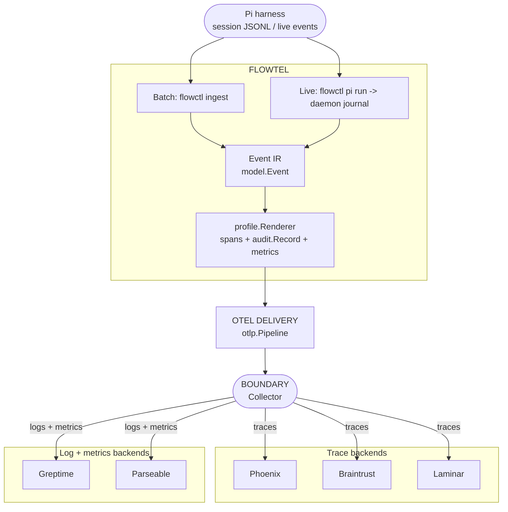

# Flowtel

Flowtel is a small, vendor-neutral Go library for tracing coding-harness work.
Pi is the first adapter. The core emits OpenTelemetry spans and bounded audit
logs with OpenInference and OTel GenAI attributes on the same spans.



No SDK dependency · no proprietary attributes · no raw payloads by default.
Flow order: `session -> llm -> tool -> permission`.

## Backend signal support

Not every backend accepts every OTLP signal. Confirmed by checking each
platform's own OTLP ingestion docs directly (not assumed):

| Backend | Traces | Logs | Metrics |
|---|---|---|---|
| Phoenix | Yes | - | Dashboard is trace-derived, not OTLP metrics ingestion |
| Braintrust | Yes | via log-to-span conversion | No |
| Laminar | Yes | - | No — "tracing today" per their own docs |
| Greptime | Yes | Yes | Yes |
| Parseable | Yes | Yes | Yes |

`flowtel` exports all three signals (traces, logs, metrics) whenever the
harness data supports it; `configs/collector/flowtel.yaml` only routes each
signal to backends that actually accept it. Metrics export can be disabled
entirely with `FLOWTEL_METRICS=0` (default on) — useful if you're only
wired to a traces-only backend and don't want a periodic export error in
the Collector's logs.

The implementation follows [SPEC.md](SPEC.md). The daemon (`internal/daemon`),
Pi adapter, profile renderer, audit record, and OTel span/log/metric export
are all implemented. CLI (binary `flowctl`): `flowctl ingest` (batch),
`flowctl daemon serve` + `flowctl pi run` (live), `flowctl status` (live TUI),
`flowctl doctor` (diagnostics).

Runtime structs are in `internal/config` and focused reusable bounds are in
`internal/bounds`. Values come from environment variables such as
`FLOWTEL_HARNESS`, `FLOWTEL_ATTRIBUTE_PROFILE`, and `FLOWTEL_OTLP_ENDPOINT`.
`FLOWTEL_ENVIRONMENT` and `FLOWTEL_RELEASE` are optional and, when set, are
stamped as `deployment.environment.name` and `service.version` on the OTel
resource for every span, log record, and metric this pipeline exports.
Collector destinations stay in `configs/collector/flowtel.yaml` and are
provided through environment references.

Run the full CI-equivalent check locally with:

```sh
make ci
```

That runs `go mod tidy` drift check, the race-detected test suite,
`go vet`, `golangci-lint`, and the end-to-end smoke script
(`scripts/smoke-e2e.sh`) in order — see `Makefile` for the individual
targets (`test`, `vet`, `lint`, `smoke`, `collector`).

Create a release by pushing a tag such as `v0.1.0`. GitHub Actions runs
GoReleaser from `.goreleaser.yaml` and publishes the cross-platform archives.
The CLI version, commit, and build date are injected by GoReleaser ldflags.
