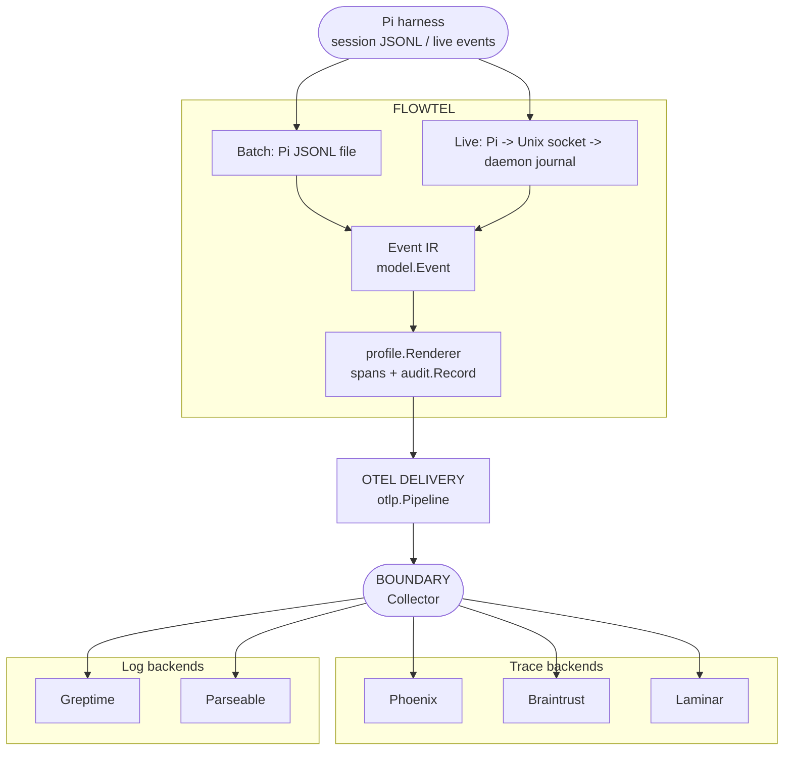

# Flowtel

Flowtel is a small, vendor-neutral Go library for tracing coding-harness work.
Pi is the first adapter. The core emits OpenTelemetry spans and bounded audit
logs with OpenInference and OTel GenAI attributes on the same spans.



No SDK dependency · no proprietary attributes · no raw payloads by default.
Flow order: `session -> llm -> tool -> permission`.

The implementation follows [SPEC.md](SPEC.md). The current slice contains the
event model, profile renderer, audit record, and official OpenTelemetry span
recorder. Pi JSONL parsing, CLI wiring, and compatibility fixtures are next.

Runtime structs are in `internal/config` and focused reusable bounds are in
`internal/bounds`. Values come from environment variables such as
`FLOWTEL_HARNESS`, `FLOWTEL_ATTRIBUTE_PROFILE`, and `FLOWTEL_OTLP_ENDPOINT`.
Collector destinations stay in `configs/collector/flowtel.yaml` and are
provided through environment references.

Run the checks with:

```sh
go test ./...
go test -race ./...
go vet ./...
```

Create a release by pushing a tag such as `v0.1.0`. GitHub Actions runs
GoReleaser from `.goreleaser.yaml` and publishes the cross-platform archives.
The CLI version, commit, and build date are injected by GoReleaser ldflags.
