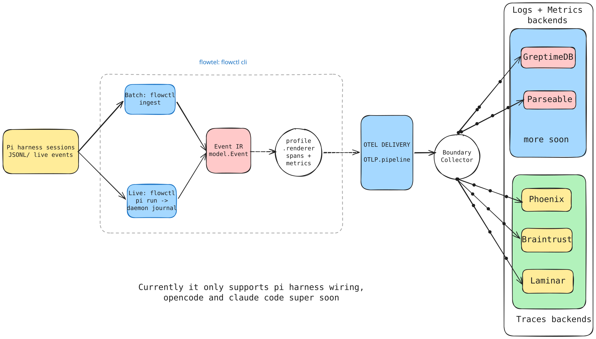

# Flowtel

Flowtel is a small, vendor-neutral Go library for tracing coding-harness work.
Pi is the first adapter. The core emits OpenTelemetry spans and bounded audit
logs with OpenInference and OTel GenAI attributes on the same spans.

<p align="center">
  
</p>

No SDK dependency · no proprietary attributes · no raw payloads by default.
Flow order: `session -> llm -> tool -> permission`.

## Backend signal support

Not every backend accepts every OTLP signal. Confirmed by checking each
platform's own OTLP ingestion docs directly (not assumed):

| Backend | Traces | Logs | Metrics |
|---|---|---|---|
| Phoenix | Yes | - | Dashboard is trace-derived, not OTLP metrics ingestion |
| Braintrust | Yes | via log-to-span conversion | No |
| Laminar | Yes | - | No, "tracing today" per their own docs |
| Greptime | Yes | Yes | Yes |
| Parseable | Yes | Yes | Yes |

Flowtel exports traces, logs and metrics when the harness data has them.
`configs/collector/flowtel.yaml` sends each signal only to backends that
accept it. Set `FLOWTEL_METRICS=0` to turn off metrics export, for example
when you only use a traces backend and want no export errors in the
Collector logs.

## Status

The code follows [SPEC.md](SPEC.md). The daemon, Pi adapter, profile
renderer, audit record and OTel export all work. The `flowctl` CLI has
these commands:

- `flowctl ingest` reads finished sessions in batch.
- `flowctl daemon serve` and `flowctl pi run` trace live sessions.
- `flowctl status` shows a live TUI.
- `flowctl doctor` runs diagnostics.

If a model response has reasoning text, the span records only its length
in `flowtel.thinking.chars`. Flowtel never exports the text itself, because
it is a raw payload.

## Configuration

Flowtel reads its settings from environment variables. The Collector
destinations live in `configs/collector/flowtel.yaml`.

| Variable | Use |
|---|---|
| `FLOWTEL_HARNESS` | Harness adapter, for example `pi`. |
| `FLOWTEL_ATTRIBUTE_PROFILE` | `openinference`, `gen_ai` or `both`. |
| `FLOWTEL_OTLP_ENDPOINT` | OTLP endpoint to export to. |
| `FLOWTEL_ENVIRONMENT` | Optional. Sets `deployment.environment.name`. |
| `FLOWTEL_RELEASE` | Optional. Sets `service.version`. |
| `FLOWTEL_TAGS` | Optional `key=value,key=value` resource attributes. |
| `FLOWTEL_METRICS` | Set to `0` to turn off metrics. On by default. |

Flowtel adds the environment, release and tags to every span, log and
metric it exports. It skips a malformed tag or a tag that uses a reserved
key and logs a warning.

## Development

Run the same checks as CI:

```sh
make ci
```

This runs the `go mod tidy` drift check, tests with the race detector,
`go vet`, `golangci-lint` and `scripts/smoke-e2e.sh`. The `Makefile` has
each step as its own target.

To release, push a tag such as `v0.1.0`. GitHub Actions runs GoReleaser,
which builds the archives for each platform and sets the version, commit
and build date.
